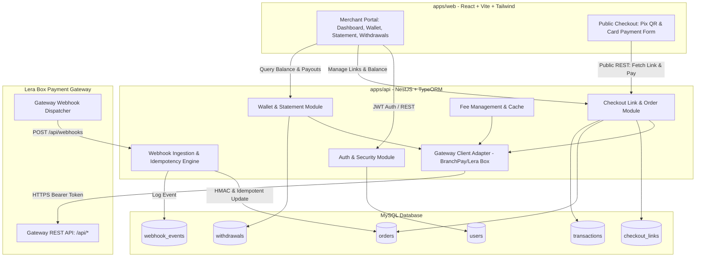

# BaaS Core Architecture & Technical Design

**Spec**: `.specs/features/baas-core/spec.md`
**Status**: Approved

---

## Architecture Overview

The system is structured as a full-stack monorepo with an event-driven and RESTful architecture:



---

## Code Structure & Monorepo Layout

```
.
├── apps/
│   ├── api/                     # NestJS backend
│   │   ├── src/
│   │   │   ├── common/          # Filters, interceptors (correlation-id, logging), decorators
│   │   │   ├── config/          # TypeORM configuration, environment schema
│   │   │   ├── modules/
│   │   │   │   ├── auth/        # User authentication & JWT guards
│   │   │   │   ├── gateway/     # HTTP client for Lera Box / BranchPay API
│   │   │   │   ├── checkout/    # Checkout links, Orders, Payments (Pix & Card)
│   │   │   │   ├── wallet/      # Wallet balance, statement, withdrawals
│   │   │   │   ├── fees/        # Fee tables and cache
│   │   │   │   └── webhooks/    # Inbound webhook receiver & idempotency
│   │   │   ├── database/        # TypeORM entities & migrations
│   │   │   ├── main.ts          # Bootstrap with Swagger, ValidationPipe, CORS
│   │   │   └── app.module.ts
│   │   ├── test/                # Unit & E2E integration tests
│   │   └── package.json
│   └── web/                     # React + Vite frontend
│       ├── src/
│       │   ├── api/             # Axios/Fetch API client for BaaS API
│       │   ├── components/      # UI components (Cards, Tables, Modals, QR display)
│       │   ├── pages/
│       │   │   ├── Dashboard/   # Merchant balance, statements, link generator
│       │   │   ├── Checkout/    # Public customer checkout (Pix/Card)
│       │   │   └── Withdrawals/ # Payout request & tracking
│       │   ├── hooks/
│       │   └── App.tsx
│       └── package.json
├── docker-compose.yml           # MySQL 8 + API + Web containers
├── package.json                 # Monorepo root with npm workspaces
└── AGENTS.md
```

---

## Data Models (TypeORM Entities)

### 1. `User`
```typescript
@Entity('users')
export class User {
  @PrimaryGeneratedColumn('uuid')
  id: string;

  @Column({ unique: true })
  email: string;

  @Column()
  passwordHash: string;

  @Column()
  name: string;

  @CreateDateColumn()
  createdAt: Date;
}
```

### 2. `CheckoutLink`
```typescript
@Entity('checkout_links')
export class CheckoutLink {
  @PrimaryGeneratedColumn('uuid')
  id: string;

  @Column({ unique: true })
  slug: string;

  @Column()
  title: string;

  @Column({ type: 'int', comment: 'Amount in cents (e.g. 5000 = R$ 50.00)' })
  amountCents: number;

  @Column({ type: 'enum', enum: ['ACTIVE', 'PAID', 'EXPIRED', 'CANCELLED'], default: 'ACTIVE' })
  status: string;

  @Column({ type: 'datetime', nullable: true })
  expiresAt: Date;

  @ManyToOne(() => User)
  merchant: User;

  @CreateDateColumn()
  createdAt: Date;
}
```

### 3. `Order`
```typescript
@Entity('orders')
export class Order {
  @PrimaryGeneratedColumn('uuid')
  id: string;

  @Column({ unique: true })
  externalReference: string; // Internal UUID sent to Gateway for reconciliation

  @Column({ nullable: true })
  gatewayPaymentId: string; // ID returned by Gateway

  @Column({ type: 'enum', enum: ['PIX', 'CARD'] })
  paymentMethod: string;

  @Column({ type: 'int' })
  amountCents: number;

  @Column({ type: 'decimal', precision: 5, scale: 2, default: 0 })
  feePercent: number;

  @Column({ type: 'int', default: 1 })
  installments: number;

  @Column({ type: 'enum', enum: ['PENDING', 'APPROVED', 'DENIED', 'EXPIRED', 'CANCELLED'], default: 'PENDING' })
  status: string;

  @Column({ type: 'text', nullable: true })
  pixQrCodeBase64: string;

  @Column({ type: 'text', nullable: true })
  pixEmv: string;

  @ManyToOne(() => CheckoutLink)
  checkoutLink: CheckoutLink;

  @CreateDateColumn()
  createdAt: Date;

  @UpdateDateColumn()
  updatedAt: Date;
}
```

### 4. `Withdrawal`
```typescript
@Entity('withdrawals')
export class Withdrawal {
  @PrimaryGeneratedColumn('uuid')
  id: string;

  @Column({ nullable: true })
  gatewayWithdrawalId: string;

  @Column({ type: 'int' })
  amountCents: number;

  @Column()
  pixKeyType: string;

  @Column()
  pixKey: string;

  @Column({ type: 'enum', enum: ['PENDING', 'PROCESSING', 'APPROVED', 'DENIED'], default: 'PENDING' })
  status: string;

  @CreateDateColumn()
  createdAt: Date;
}
```

### 5. `WebhookEvent`
```typescript
@Entity('webhook_events')
export class WebhookEvent {
  @PrimaryGeneratedColumn('uuid')
  id: string;

  @Column({ nullable: true })
  eventType: string; // PAYMENT_PIX, PAYMENT_CARD, WITHDRAWAL

  @Column({ nullable: true })
  externalReference: string;

  @Column({ type: 'json' })
  payload: Record<string, any>;

  @Column({ default: false })
  processed: boolean;

  @Column({ type: 'text', nullable: true })
  processingError: string;

  @CreateDateColumn()
  receivedAt: Date;
}
```

---

## Gateway Client Design (`LeraBoxGatewayClient`)

The adapter handles:
1. **Authentication Token Lifecycle**: Auto-authenticates via `POST /api/auth/login` on bootstrap or token expiration, caching Bearer token in memory.
2. **Fee Cache**: Periodically caches `GET /api/fees` and validates installment percentages before dispatching card charges.
3. **Resilience & Correlation**: Injects correlation IDs on requests and wraps HTTP exceptions with contextual BaaS errors.

---

## Error Handling Strategy

| Error Scenario | Handling | User Impact |
| --- | --- | --- |
| Gateway 401 Unauthorized | Auto-reauthenticate with stored credentials and retry once | Transparent recovery, no user impact |
| Gateway 4xx Validation / Fee mismatch | Map to 400 Bad Request with explicit parameter reason | Clean validation feedback on checkout UI |
| Gateway 5xx / Timeout | Keep Order in `PENDING` state and log correlation ID | Payer sees pending status; webhook/polling reconciles |
| Duplicate Webhook delivery | Detect existing event/reference in DB transaction and return 200 OK | Safe no-op, prevents double-crediting |

---

## Risks & Concerns

| Concern | Location | Impact | Mitigation |
| --- | --- | --- | --- |
| Floating point arithmetic in fees | Fee module & payments | Off-by-one cent discrepancy with gateway validation | Enforce integer arithmetic in cents; parse feePercent with strict decimals |
| Gateway sandbox random approval/denial | Checkout flow | Intermittent payment failures | Public checkout UI provides clear retry and real-time status feedback |
| Concurrent webhook updates | Webhook service | Race conditions on order status | Use database row locks / transactions for status transitions |
