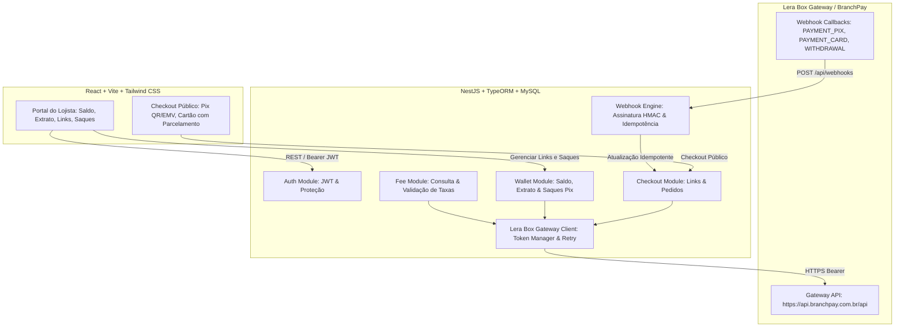

# 💳 Lera Pay - Banking as a Service (BaaS) & Gateway Integration

Plataforma de **Banking as a Service (BaaS)** desenvolvida para o desafio técnico da **Lera Pay / VBA Systems**, integrada ao gateway de pagamentos **Lera Box (BranchPay)**.

---

## 🏛️ Arquitetura & Visão Geral

A solução foi construída em monorepo com arquitetura orientada a microsserviços/módulos independentes:



---

## 🚀 Tecnologias Utilizadas

- **Backend**: NestJS (TypeScript), TypeORM, MySQL 8, `@nestjs/swagger`, `class-validator`, `bcrypt`, `passport-jwt`.
- **Frontend**: React 18, Vite, TypeScript, Tailwind CSS, Lucide Icons, `qrcode.react`.
- **Infraestrutura**: Docker Compose multi-stage containers para MySQL, API e Frontend Nginx.
- **Padrões de Engenharia**: EARS requirements, Gitmoji Conventional Commits, Idempotência transacional no MySQL, tratamento monetário estrito em **centavos**.

---

## 📦 Como Executar

### Opção 1: Via Docker Compose (Recomendado)

1. Clone o repositório:
```bash
git clone https://github.com/SEU_USUARIO/nest.git
cd nest
```

2. Configure as variáveis de ambiente (opcional para simulação local, ou insira as credenciais reais do gateway):
```bash
cp .env.example .env
```

3. Inicie os containers:
```bash
docker compose up --build -d
```

- **Frontend (Lojista & Checkout)**: [http://localhost:5173](http://localhost:5173)
- **Backend API**: [http://localhost:3000](http://localhost:3000)
- **Documentação Swagger**: [http://localhost:3000/api/docs](http://localhost:3000/api/docs)
- **MySQL**: `localhost:3306` (`root`/`root`, database: `lerapay_baas`)

---

### Opção 2: Execução Local (Desenvolvimento)

1. Instale as dependências com `bun` ou `npm`:
```bash
bun install # ou npm install
```

2. Inicie o Backend:
```bash
cd apps/api
bun run start:dev
```

3. Inicie o Frontend:
```bash
cd apps/web
bun run dev
```

4. Execute a suíte de testes automatizados:
```bash
cd apps/api
bun run test
```

---

## 🔐 Credenciais de Demonstração

Para acessar o Dashboard do Lojista:
- **E-mail**: `demo@lerapay.com`
- **Senha**: `123456`
*(Ou cadastre uma nova conta diretamente na tela de login).*

---

## 📑 Documentação dos Endpoints (Swagger)

Acesse a documentação interativa completa em:
👉 **[http://localhost:3000/api/docs](http://localhost:3000/api/docs)**

### Principais Rotas:
- `POST /api/auth/register` & `POST /api/auth/login`: Autenticação do lojista.
- `GET /api/fees` & `GET /api/fees/calculate`: Consulta de taxas e cálculo dinâmico de parcelas.
- `POST /api/checkout/links`: Criação de links de checkout com slug único e valor em centavos.
- `GET /api/checkout/links/:slug`: Consulta pública do link para o checkout.
- `POST /api/checkout/pay/:slug/pix`: Geração de QR Code e EMV Pix.
- `POST /api/checkout/pay/:slug/card`: Processamento de pagamento via Cartão com validação de taxas.
- `GET /api/wallet`: Saldo disponível na carteira sincronizado com o gateway.
- `GET /api/wallet/transactions`: Extrato financeiro com filtros por status (`APPROVED`, `DENIED`, `EXPIRED`, `CANCELLED`).
- `POST /api/wallet/withdrawals`: Solicitação de saque Pix.
- `POST /api/webhooks`: Endpoint receptor de callbacks com validação `X-Lera-Box-Signature` e idempotência.

---

## 🛡️ Segurança & Idempotência

1. **Proteção de Segredos**: As credenciais do gateway (`GATEWAY_EMAIL`, `GATEWAY_PASSWORD`, `ChaveLoja`) residem exclusivamente no backend e nunca são trafegadas para o frontend.
2. **Idempotência**: Todos os webhooks recebidos são gravados na tabela `webhook_events`. Eventos repetidos para a mesma `externalReference` são reconhecidos (200 OK) sem duplicar atualizações de saldo ou pedidos.
3. **Validação de Assinatura**: O cabeçalho `X-Lera-Box-Signature` é verificado via HMAC SHA256 antes da execução de transações.
4. **Precisão Monetária**: Todos os valores são manipulados como inteiros em centavos (R$ 10,00 = `1000`), eliminando discrepâncias de ponto flutuante.
